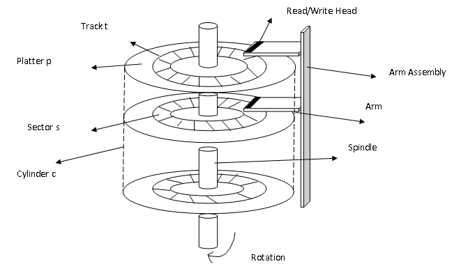

# Disk Scheduling Algorithms in Python


"> 
<br>

Implemented various Disk Scheduling Algorithms in Python
<br>
<br><b> Following Disk Scheduling Algorithms are demonstrated:<br></b>
    1. N-Step Scan<br>
    2. F-scan<br>
    3. RSS<br>
   
<br>
The process needs either CPU time or Input/Output Time. And for I/O it requires access to disk. The technique that operating system uses to determine the request which is to be satisfied next is called disk scheduling.<br>
<br>

<font size = 1>
<br>Image Source:<br>
https://notesformsc.org/computer-science/operating-systems/operating-systems-disk-scheduling-algorithms/<br> </font>

<br>
 
Seek Time<br>
Seek time is the time taken in locating the disk arm to a specified track where the read/write request will be satisfied.
<br><br>
Rotational Latency<br>
It is the time taken by the desired sector to rotate itself to the position from where it can access the R/W heads.
<br><br>
Transfer Time<br>
It is the time taken to transfer the data.
<br><br>
Disk Access Time<br>
Disk access time is given as,
<br><br>
Disk Access Time = Rotational Latency + Seek Time + Transfer Time
<br><br>
Disk Response Time<br>
It is the average of time spent by each request waiting for the IO operation.
This repository contains implementations of various disk scheduling algorithms used in operating systems for efficient disk I/O operations. The implemented algorithms include F-SCAN, RSS (Rotational Shortest Seek), and n-step SCAN.

# Introduction

This project aims to simulate and visualize the working of three disk scheduling algorithms: N-Step SCAN (n-SCAN), F-SCAN, and RSS (Rotational Scheduling).

## Features

- *N-Step SCAN Algorithm:* Simulates the N-Step SCAN disk scheduling algorithm.
- *F-SCAN Algorithm:* Simulates the F-SCAN disk scheduling algorithm.
- *RSS Algorithm:* Simulates the Rotational Scheduling (RSS) disk scheduling algorithm.

## Description

Disk scheduling algorithms are crucial components of operating systems responsible for optimizing the order in which disk I/O requests are serviced. This project provides a hands-on demonstration of three popular disk scheduling algorithms, allowing users to observe their behavior and understand their impact on system performance.

## Getting Started

### Prerequisites

- Python (version X.X.X)
- Jupyter Notebook or VS Code

### Installation

 Clone the repository to your local machine:

   bash
   git clone https://github.com/MuhammadBurhan12/Disk-Scheduling-Algorithm
   

 Navigate to the project directory:

  bash
   cd Disk-Scheduling-Algorithm
   

## Algorithms

### 1. N-Step SCAN Algorithm

The N-Step SCAN algorithm is a disk scheduling algorithm used to optimize the order in which I/O requests are serviced on a disk. It is an extension of the SCAN algorithm, which moves the disk arm in one direction, serving requests until it reaches the end of the disk, at which point it reverses direction.

*Characteristics:*

- *Movement:* The N-Step SCAN algorithm divides the disk into zones, and the disk arm moves in one direction servicing requests within the current zone for N steps before moving to the next zone.
  
- *Enhanced Locality:* By focusing on a limited number of zones in each pass, the algorithm exhibits enhanced locality of reference, reducing seek time.

- *Fairness:* N-Step SCAN provides fairness by ensuring that requests in all zones receive service within a reasonable time frame.

### 2. F-SCAN Algorithm

The F-SCAN (Fast SCAN) algorithm is an enhancement of the SCAN algorithm, designed to reduce the high variance in response times observed in traditional SCAN algorithms.

*Characteristics:*

- *Multiple Queues:* F-SCAN maintains multiple request queues, and the disk arm services requests in a round-robin fashion across these queues.
  
- *Reduced Variance:* By servicing requests in a more balanced manner, F-SCAN reduces the variance in response times compared to traditional SCAN algorithms.

- *Enhanced Responsiveness:* The algorithm ensures that each queue receives fair service, contributing to enhanced responsiveness and reduced waiting times.

### 3. RSS Algorithm

The Rotational Scheduling (RSS) algorithm is a disk scheduling approach that takes into account the rotational latency of a disk, aiming to minimize the time spent waiting for the desired disk sector to rotate under the disk arm.

*Characteristics:*

- *Rotational Latency Consideration:* RSS considers the rotational latency involved in waiting for the desired disk sector to rotate under the disk arm.
  
- *Optimized Sector Selection:* The algorithm optimizes the selection of disk sectors to minimize the overall rotational latency, contributing to improved disk access performance.

- *Sequential Access Optimization:* RSS is particularly effective in scenarios where there is a degree of locality in data access patterns, optimizing sequential access to reduce rotational latency.

RSS Scheduling Algorithm
Description
RSS (Rotational Shortest Seek) is a disk scheduling algorithm that aims to minimize the rotational latency by selecting the disk request with the shortest seek time. It considers both the distance to the requested track and the rotational position of the disk.
Usage:
from disk_scheduling import rss

# Example usage:
sequence = [10, 20, 30, 40, 50]
start = 25
rss(sequence, start)

n-step SCAN Scheduling Algorithm
Description
n-step SCAN is an extension of the SCAN algorithm. It divides the disk into n zones and services requests in a round-robin manner within each zone. It helps prevent starvation of requests in the outer tracks.
Usage:
from disk_scheduling import n_step_scan

# Example usage:
sequence = [10, 20, 30, 40, 50]
start = 25
n = 3
n_step_scan(sequence, start, n)
F-scan disk scheduling algorithm:
F-SCAN is a disk scheduling algorithm designed to optimize head movement during disk I/O operations. It utilizes a fixed-size queue to keep track of recently accessed disk locations, scanning the disk in both forward and backward directions.
## F-SCAN Scheduling Algorithm

### Description
F-SCAN is a disk scheduling algorithm that uses a fixed-size queue to keep track of the recently accessed disk locations. It scans the disk in a forward and backward manner, minimizing head movement.
## How F-SCAN Works

1. **Initialization:** The algorithm starts with a given sequence of disk requests and the initial head position.

2. **Sorting:** The requested disk locations, along with the initial head position, are sorted in ascending order.

3. **Forward Scan:** The head moves to the right, serving disk requests in the sorted order until the end of the sequence. The algorithm records the disk locations and the distance covered by the head.

4. **Backward Scan:** The head then moves back to the starting position and continues to the left, serving disk requests in reverse order. Again, the algorithm records the disk locations and the distance covered by the head.

5. **Head Movement Calculation:** The total head movement is calculated as the sum of the absolute differences between consecutive disk locations during both forward and backward scans.

## Usage

To use the F-SCAN algorithm in your Python program:

```python
from disk_scheduling import f_scan

# Example usage:
sequence = [10, 20, 30, 40, 50]
start = 25
f = 2
f_scan(sequence, start, f)
Example Visualization
The algorithm's execution can be visualized through a plot, showing the movement of the disk head and providing information about the total head movement.


